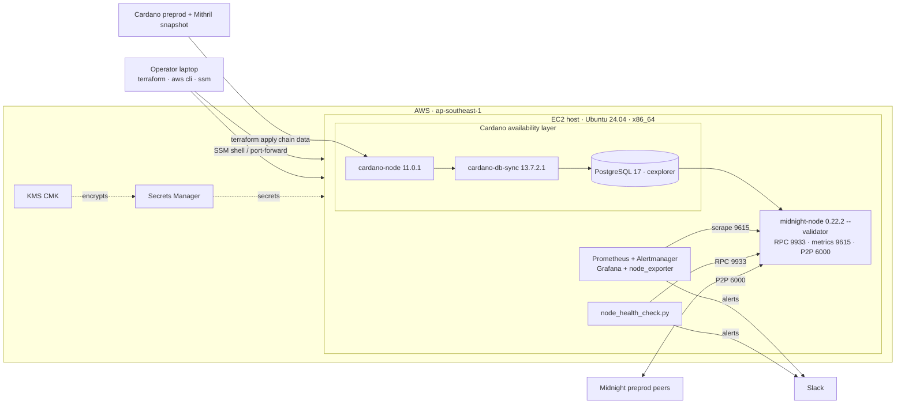

# Midnight Validator Lab — Pre-Prod (FNO)

[](https://github.com/dungpham91/midnight-validator-lab/actions/workflows/ci.yml)

A hands-on lab and reference for running a Midnight **Founding Node Operator (FNO)** validator
against the **pre-prod** network: node onboarding, monitoring and alerting, a health-check
tool, and key-management notes. Everything runs on a single Ubuntu 24.04 host so you can
follow it end to end.

Pre-prod mirrors mainnet, which makes it a good place to practise the full operator workflow
before touching real stake.

> **Scope — why it looks like a lot.** This is a *reference* lab, not a minimal walkthrough.
> It deliberately layers on production-minded extras — Infrastructure-as-Code (`terraform/`),
> CI (`.github/`), a monitoring stack (`monitoring/`), and security hardening — to show how
> you'd actually *operate* a validator, not just start one once. If you only want the node up,
> follow [`RUNBOOK.md`](RUNBOOK.md) (or run [`scripts/setup_node.sh`](scripts/setup_node.sh));
> everything else is optional and layered on top, so you can take only the parts you need.

## Architecture



Provision with [`terraform/`](terraform/) (or bring your own host), run
[`scripts/setup_node.sh`](scripts/setup_node.sh) to build the stack, then
[`monitoring/`](monitoring/) + [`scripts/node_health_check.py`](scripts/) watch it. Security
architecture (secrets/KMS/IAM/network) is in [`SECURITY.md`](SECURITY.md).

## What's here

| Area | Where | Notes |
|---|---|---|
| Node onboarding | [`RUNBOOK.md`](RUNBOOK.md) | Mithril-bootstrapped cardano-node 11.0.1 → PostgreSQL 17 → cardano-db-sync 13.7.2.1 → midnight-node 0.22.2 in validator mode, key generation, FNO registration |
| Monitoring & alerting | [`monitoring/`](monitoring/) | Prometheus + Alertmanager + Grafana + node_exporter, three core alerts routed to Slack |
| Setup automation | [`scripts/setup_node.sh`](scripts/setup_node.sh) | Scripts the runbook (Cardano → Postgres → db-sync → Midnight), logging + `--dry-run` |
| Health automation | [`scripts/`](scripts/) | `node_health_check.py` — RPC health checker with regression diffing |
| Key management | [`SECURITY.md`](SECURITY.md) | Storage, rotation, incident response for the four validator keys |
| Provisioning | [`terraform/`](terraform/) | One-command AWS host with security baked in (Secrets Manager, KMS, IMDSv2, SSM) |
| Run evidence | [`evidence/`](evidence/) | Sync %, block-progression logs, dashboard screenshots |

## Repo layout

```
├── README.md            # this file
├── RUNBOOK.md           # node onboarding, handoff-ready
├── SECURITY.md          # key storage, rotation, incident response
├── monitoring/          # Prometheus + Alertmanager + Grafana + node_exporter
│   ├── docker-compose.yml
│   ├── prometheus/{prometheus.yml, alert.rules.yml}
│   ├── alertmanager/alertmanager.yml
│   └── grafana/{provisioning, dashboards/midnight-node.json}
├── scripts/             # node_health_check.py (+ README)
└── evidence/            # logs/screenshots of block progression
```

## Quick start

```bash
# 0. (optional) Provision the AWS host + secrets in one step — see terraform/
cd terraform && cp terraform.tfvars.example terraform.tfvars && terraform init && terraform apply

# 1. Node — follow RUNBOOK.md on an Ubuntu 24.04 host. Start Cardano DB Sync first;
#    it is the long pole (several hours even with Mithril). Everything else waits on it.

# 2. Monitoring
cd monitoring && docker compose up -d      # Grafana :3000, Prometheus :9090
#    See monitoring/README.md for the full setup, Slack wiring, and alert-testing steps.

# 3. Health checker
./scripts/node_health_check.py --once      # or --interval 60
```

## Reference environment & rough cost

This guide was written and tested against the host below. Any equivalent machine on any cloud
(or bare metal) works — match the specs, not the vendor.

**Reference host (AWS EC2, `ap-southeast-1` / Singapore):**
- `r6i.2xlarge` — 8 vCPU, 64 GiB RAM (minimum cores + comfort RAM per §1.2), **x86_64**
- `gp3` EBS volume, 640 GB
- Ubuntu 24.04 LTS

> **Use x86_64:** this lab pins the `linux-amd64` artifacts. ARM64 builds exist for
> cardano-node and midnight-node, but cardano-db-sync ships a single linux (amd64) build, so
> this lab standardises on amd64 — use an x86_64 instance (not Graviton) here. Check each
> component's release page if you need ARM.

**Rough on-demand cost** (`ap-southeast-1`, early-2026 pricing; billed per-second/hour):

| Component | Spec | Hourly | ~1 day | ~/month |
|---|---|---|---|---|
| EC2 `r6i.2xlarge` | 8 vCPU / 64 GiB | $0.608 | $14.59 | $444 |
| `gp3` 640 GB, baseline | 3,000 IOPS + 125 MB/s (free) | $0.084 | $2.02 | $61 |
| `gp3` 640 GB, provisioned | 10,000 IOPS + 250 MB/s (faster DB Sync) | $0.150 | $3.60 | $109 |
| Public IPv4 | 1 address | $0.005 | $0.12 | $3.6 |

Singapore gp3 rates: $0.096/GB-mo, $0.006/provisioned-IOPS-mo, $0.048/MB/s-mo. (us-east-1 is
`~20% cheaper` — `r6i.2xlarge` $0.504/hr, gp3 $0.08/GB-mo — if latency to your region allows it.)
Not in the table (small, but real): the Terraform stack also adds KMS (`~$1/mo`), Secrets
Manager (`~$0.40/secret/mo`), CloudWatch detailed monitoring, and VPC flow-log ingestion — a
few dollars/month, prorated, and gone on `terraform destroy`.

**Full run (~1.5 days):** ≈ **$25** with baseline gp3, ≈ **$28** with provisioned gp3
(10k IOPS — recommended for a snappier DB Sync).

**Cheaper / alternatives (Singapore, approximate):**
- Smoke-test box: `t3.micro` (2 vCPU / 1 GiB) ~$0.013/hr — for validating the setup script only
  (see the `test.tfvars.example` in `terraform/`); too small for a real DB Sync.
- Minimum spec: `m6i.2xlarge` (8 vCPU / 32 GiB) ~$0.46/hr.
- AMD: `r6a.2xlarge` (8 vCPU / 64 GiB) ~$0.55/hr.
- Spot cuts compute ~60–70% but can be reclaimed mid-sync (risky for a 6h+ sync).
- **AWS Lightsail** memory-optimized 8 vCPU / 64 GB / 640 GB (region-dependent, roughly
  $10–12/day) is cheaper but does not commit to an IOPS level, so DB Sync runs slower — fine
  for pre-prod; use EC2 `gp3`/`io2` for the ≥20,000 IOPS the spec asks for (see
  [Notes](#notes--limitations)).

> **Cost control:** storage bills while the volume exists even if the instance is stopped.
> When finished, terminate the instance **and delete the gp3 volume plus any snapshots.**

## Provisioning (Terraform)

[`terraform/`](terraform/) builds the whole host in one step, with security defaults baked in
so you don't wire them by hand:

- Generated Postgres password + optional per-channel Slack webhooks in **AWS Secrets Manager** (never in
  code or committed state output); the instance reads them at runtime via a least-privilege
  IAM role.
- **KMS CMK** (rotation on) encrypts the secrets and the **EBS** volume.
- **IMDSv2 required**; admin access via **SSM Session Manager** (no SSH port open by default);
  security group opens only P2P — RPC/metrics/Grafana are reached by SSM port-forwarding.

```bash
cd terraform
cp terraform.tfvars.example terraform.tfvars   # set region/owner
terraform init && terraform apply
eval "$(terraform output -raw ssm_start_session)"   # shell in, no SSH
```

`terraform destroy` tears it all down. See [`terraform/README.md`](terraform/README.md) for
the full resource list and security rationale.

> This module is intentionally minimal — a fast way to get the lab host up, not a template for
> structuring a production Terraform codebase. For a cleaner standard layout (modules,
> environments, remote state), see
> [`dungpham91/devops.demo.terraform`](https://github.com/dungpham91/devops.demo.terraform).
> It is scanned with `checkov` (0 failing checks; accepted tradeoffs suppressed with reasons).

## Monitoring & alert design

A validator has one job: stay up, stay connected, and keep advancing blocks. The three core
alerts each guard one of those. Each has a `for:` window so a single bad scrape never pages,
and each maps to a documented response (details in [`monitoring/README.md`](monitoring/README.md)).

| Alert | Signal | Response |
|---|---|---|
| `MidnightNodeDown` | `up == 0` for 2m | `systemctl status` + `journalctl`; check OOM/disk; restart; roll back if crash-looping |
| `MidnightBlockProgressionStalled` | best block height unchanged 10m | Check peers and cardano-db-sync/Postgres (the node stalls if its data source stalls); escalate if network-wide |
| `MidnightLowPeerCount` | peers `< 3` (10m) / `== 0` (5m) | Verify P2P port 6000, outbound connectivity, boot-node reachability |

There is deliberately no alert for "no blocks produced yet": a freshly onboarded FNO is passive
until its keys are authorised and the n+2 epoch cycle elapses (see [`RUNBOOK.md`](RUNBOOK.md)
§5.4.2). Once in the active set, add a per-slot "missed block" alert.

## Design choices worth calling out

- **Single-host layout** (node + Cardano stack co-located), matching the pre-prod hardware
  guidance. A production deployment would separate these concerns.
- **Bare-metal + systemd**, following the official FNO pre-prod runbook (not the Docker
  Compose path, which is a separate install method).
- **Pinned versions** track what the pre-prod network currently requires — cardano-node 11.0.1
  and cardano-db-sync 13.7.2.1 (the pair that crosses the van Rossem/PV11 hard fork), midnight-node
  0.22.2, PostgreSQL 17, RPC port 9933. Cardano versions move with on-chain hard forks, so verify
  the current requirement against the upstream releases before installing (see RUNBOOK §2.2.1).
- **WireGuard is skipped**: the overlay is a mainnet-only concern; pre-prod uses standard peer
  discovery ([`RUNBOOK.md`](RUNBOOK.md) §4).
- **Secrets stay out of git**: `.gitignore` blocks keys, `.env`, `.pgpass`, and the Slack
  webhook. Only public keys ever leave the host.

## Tooling & versions

Pinned for reproducibility. The Midnight/Cardano components each have their own compatibility
requirements — **re-check the current requirements against the stack's own docs and release
pages** (e.g. `docs.midnight.network`, the `midnightntwrk/midnight-node` and IntersectMBO
releases) before changing them. This lab fixes them at the versions below; everything else is
the latest at time of writing.

**Midnight / Cardano stack (pinned in this lab):**

| Component | Version |
|---|---|
| cardano-node | 11.0.1 |
| cardano-db-sync | 13.7.2.1 |
| midnight-node | 0.22.2 (tag `node-0.22.2`) |
| PostgreSQL | 17 |
| Mithril client | `unstable` channel |
| WireGuard tools (mainnet only) | v1.0.20250521 |

**Monitoring (Docker images):**

| Image | Version |
|---|---|
| prom/prometheus | v3.13.1 |
| prom/alertmanager | v0.33.1 |
| prom/node-exporter | v1.12.0 |
| grafana/grafana | 13.1.0 |

**IaC, CI & dev tooling:**

| Tool | Version |
|---|---|
| Terraform | ≥ 1.5 (CI pins 1.9.8) |
| AWS provider / random provider | `~> 6.0` / `~> 3.9` |
| GitHub Actions | `actions/checkout` v7.0.0, `hashicorp/setup-terraform` v4.0.1, `actions/setup-python` v6.3.0 (pinned to commit SHA) |
| checkov · gitleaks · shellcheck · ruff · pytest · yamllint | latest (installed in CI) |
| AWS CLI · Session Manager plugin | v2 · latest |
| OS | Ubuntu 24.04 LTS |

## Notes & limitations

- **Block production vs syncing.** Because production requires key authorisation plus the n+2
  epoch cycle, a fresh node shows a *syncing* state (`Best: #` climbing, peers > 0, Postgres
  connected) rather than authored blocks within a short window. `evidence/` captures the
  achievable proof; see [`RUNBOOK.md`](RUNBOOK.md) §5.4.3.
- **IOPS.** The pre-prod spec asks for ≥20,000 effective IOPS. AWS publishes no IOPS figure
  for Lightsail and explicitly recommends EC2 (GP2/Provisioned IOPS) for sustained-IOPS or
  large-database workloads, which this is. Lightsail still completes pre-prod (small DB +
  Mithril), just slower; EC2 `gp3` (to 16,000) or `io2` (>20,000) meets the spec. Noted throughout.
- **db-sync download URL.** The upstream command mixes a tag with a different filename version
  and 404s. [`RUNBOOK.md`](RUNBOOK.md) §2.4 flags it, and `scripts/setup_node.sh` uses a
  verified matched tag+file (`13.7.2.1`), paired to the node version for the current hard fork.

## Troubleshooting log (first real pre-prod run)

Field notes from bringing the node up end-to-end on a fresh Ubuntu 24.04 EC2 host. Each entry
is symptom → evidence → root cause → fix, in the order they surfaced. The fixes are in
`scripts/setup_node.sh` and `RUNBOOK.md`.

### 1. db-sync install aborts moving the schema dir

```
mv: cannot move '/home/midnight/tmp/schema' to '/home/midnight/cardano-data/schema': Permission denied
```

The install runs as the non-root `midnight` user. The db-sync tarball ships `schema/` **read-only
(0555)**, and moving a *directory* to a new parent needs write permission on the directory itself
(the kernel has to rewrite its `..` entry) — which 0555 denies to a non-root user. The RUNBOOK hid
this by using `sudo mv` (root bypasses the check); the script, correctly running as the service
user, hit it. **Fix:** `cp -a` instead of `mv` (copying needs no write on the source), then
`chmod -R u+w` so the dir is idempotently removable on a re-run.

### 2. db-sync re-run can't overwrite its binaries

```
cp: cannot create regular file '/home/midnight/.local/bin/cardano-db-sync': Permission denied
```

Same read-only-artifact root cause, second face: the tarball's **binaries are 0555** too, so a
second run's `cp` can't overwrite them in place, and the non-root user can't `rm` inside a leftover
0555 dir either. **Fix:** `cp -f` (unlinks the read-only target and recreates it) plus a
`chmod -R u+w` → `rm -rf` cleanup of any prior extract before untarring.

### 3. db-sync logs "node.socket does not exist"

```
Connection Attempt Exception, destination LocalAddress ".../db/node.socket"
  exception: Network.Socket.connect: does not exist (No such file or directory)
```

**Not a bug** — startup ordering. cardano-node only opens its local socket after it finishes
replaying the ledger from the Mithril snapshot (tens of minutes on first boot). db-sync
(`Requires=cardano-node`) simply retries every ~20 s until the socket appears. No action needed;
documented so it isn't mistaken for a failure.

### 4. "sync 100%" while still a day behind

`--stage verify-sync` reported `100%` even though `now() - max(block.time)` was **~1 day**. The
original metric was *time-weighted* — `(max−min)/(now−min)` over block timestamps — which, on a
chain that is years old, rounds to 100% while the DB is still a full day short. Useless as a gate
to start the validator. **Fix:** measure **lag in seconds** (`now() - max(block.time)`), which does
not saturate, and report cardano-node's own `syncProgress` alongside it. The `--min-sync-percent`
flag became `--max-lag-seconds` (default 180).

### 5. cardano-node stalls at the hard-fork boundary

```
ChainSync.Client.Exception ... HeaderError ... ObsoleteNode (Version 11) (Version 10)
Net.Peers.Ledger.NotEnoughBigLedgerPeers {"numOfBigLedgerPeers":15,"target":75}
cardano-cli query tip → "syncProgress": "99.93"   (stuck; block/slot not advancing)
```

The node reached the Mithril snapshot tip and then **could not advance** — every peer's header was
rejected with `ObsoleteNode`. preprod had run the **van Rossem (PV11)** intra-era hard fork in late
June 2026, and `cardano-node 10.6.2` (the version pinned from the docs) is too old to decode
protocol-version-11 headers. Clock and topology were fine — it was purely a stale binary.
**Fix:** upgrade to `cardano-node 11.0.1` (first release across PV11) and the matched
`cardano-db-sync 13.7.2.1`, add the `liburing2`/`libsnappy1v5` runtime libs node 11.x needs, and
reframe version pinning to track the network's *current* hard-fork requirement (verified against
upstream release notes) rather than a fixed number copied from a doc.

## Roadmap / possible improvements

Already done in this repo: **IaC** ([`terraform/`](terraform/) — host + `gp3` volume with
provisioned IOPS, Secrets Manager, KMS, SSM), **runbook automation**
([`scripts/setup_node.sh`](scripts/setup_node.sh)), and a **systemd timer** for the health
checker ([`scripts/README.md`](scripts/README.md)). Still open:

- **Config management**: an Ansible playbook as an alternative to `setup_node.sh` for fleet use
  (the Terraform module is intentionally minimal — see the note above).
- **Secrets**: move the *validator session keys* to a `tmpfs` keystore with KMS-envelope
  decryption at boot + systemd `LoadCredential=`, instead of on-disk key files (the DB and
  Slack secrets already live in Secrets Manager — [`SECURITY.md`](SECURITY.md)).
- **Monitoring depth**: postgres_exporter + cardano-node metrics for end-to-end db-sync-lag
  visibility, a "missed block" alert once in the active set, and recording rules.
- **Automation**: pytest around the health checker (against a mock RPC).
- **HA**: a standby/failover topology with a strict single-active-signer guarantee to avoid
  equivocation.

## License

Released under the [MIT License](LICENSE) — free to use, copy, modify, and distribute with
attribution and no warranty.

Command snippets in [`RUNBOOK.md`](RUNBOOK.md) are derived from Midnight's public FNO
documentation and remain the property of their respective owners; this repository's license
covers the original scripts, Terraform, monitoring config, and documentation here.
