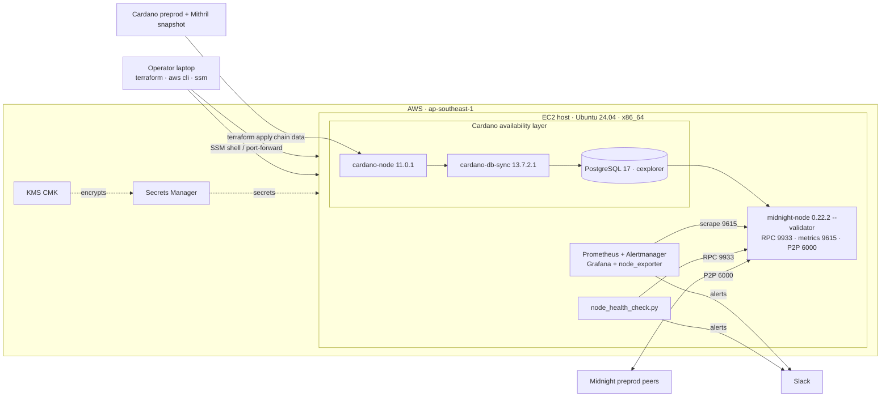

# Midnight Validator Lab — Pre-Prod (FNO)

[](https://github.com/dungpham91/midnight-validator-lab/actions/workflows/ci.yml)

A hands-on lab and reference for running a Midnight **Founding Node Operator (FNO)** validator
against the **pre-prod** network: node onboarding, monitoring and alerting, a health-check
tool, and key-management notes. Everything runs on a single Ubuntu 24.04 host so you can
follow it end to end.

Pre-prod mirrors mainnet, which makes it a good place to practise the full operator workflow
before touching real stake.

> **Scope — why it looks like a lot.** This is a *reference* lab, not a minimal walkthrough.
> It deliberately layers on production-minded extras — Infrastructure-as-Code (`terraform/`),
> CI (`.github/`), a monitoring stack (`monitoring/`), and security hardening — to show how
> you'd actually *operate* a validator, not just start one once. If you only want the node up,
> follow [`RUNBOOK.md`](RUNBOOK.md) (or run [`scripts/setup_node.sh`](scripts/setup_node.sh));
> everything else is optional and layered on top, so you can take only the parts you need.

## Architecture



Provision with [`terraform/`](terraform/) (or bring your own host), run
[`scripts/setup_node.sh`](scripts/setup_node.sh) to build the stack, then
[`monitoring/`](monitoring/) + [`scripts/node_health_check.py`](scripts/) watch it. Security
architecture (secrets/KMS/IAM/network) is in [`SECURITY.md`](SECURITY.md).

## What's here

| Area | Where | Notes |
|---|---|---|
| Node onboarding | [`RUNBOOK.md`](RUNBOOK.md) | Mithril-bootstrapped cardano-node 11.0.1 → PostgreSQL 17 → cardano-db-sync 13.7.2.1 → midnight-node 0.22.2 in validator mode, key generation, FNO registration |
| Monitoring & alerting | [`monitoring/`](monitoring/) | Prometheus + Alertmanager + Grafana + node_exporter; 10 alert rules (3 core node + supporting + host), severity-routed to two Slack channels |
| Setup automation | [`scripts/setup_node.sh`](scripts/setup_node.sh) | Scripts the runbook (Cardano → Postgres → db-sync → Midnight), logging + `--dry-run` |
| Health automation | [`scripts/`](scripts/) | `node_health_check.py` — RPC health checker with regression diffing |
| Key management | [`SECURITY.md`](SECURITY.md) | Storage, rotation, incident response for the four validator keys |
| Provisioning | [`terraform/`](terraform/) | One-command AWS host with security baked in (Secrets Manager, KMS, IMDSv2, SSM) |
| Run evidence | [`evidence/`](evidence/) | Block-progression logs, dashboards, Slack alerts — indexed in [`evidence/SUMMARY.md`](evidence/SUMMARY.md) |

## Repo layout

```
├── README.md            # this file
├── RUNBOOK.md           # node onboarding, handoff-ready
├── SECURITY.md          # key storage, rotation, incident response
├── monitoring/          # Prometheus + Alertmanager + Grafana + node_exporter
│   ├── docker-compose.yml
│   ├── prometheus/{prometheus.yml, alert.rules.yml}
│   ├── alertmanager/alertmanager.yml
│   └── grafana/{provisioning, dashboards/midnight-node.json}
├── scripts/             # node_health_check.py (+ README)
└── evidence/            # logs/screenshots of block progression
```

## Quick start

```bash
# 0. (optional) Provision the AWS host + secrets in one step — see terraform/
cd terraform && cp terraform.tfvars.example terraform.tfvars && terraform init && terraform apply

# 1. Node — follow RUNBOOK.md on an Ubuntu 24.04 host. Start Cardano DB Sync first;
#    it is the long pole (several hours even with Mithril). Everything else waits on it.

# 2. Monitoring
cd monitoring && docker compose up -d      # Grafana :3000, Prometheus :9090
#    See monitoring/README.md for the full setup, Slack wiring, and alert-testing steps.

# 3. Health checker
./scripts/node_health_check.py --once      # or --interval 60
```

## Reference environment & rough cost

This guide was written and tested against the host below. Any equivalent machine on any cloud
(or bare metal) works — match the specs, not the vendor.

**Reference host (AWS EC2, `ap-southeast-1` / Singapore):**
- `r6i.2xlarge` — 8 vCPU, 64 GiB RAM (minimum cores + comfort RAM per §1.2), **x86_64**
- `gp3` EBS volume, 640 GB
- Ubuntu 24.04 LTS

> **Use x86_64:** this lab pins the `linux-amd64` artifacts. ARM64 builds exist for
> cardano-node and midnight-node, but cardano-db-sync ships a single linux (amd64) build, so
> this lab standardises on amd64 — use an x86_64 instance (not Graviton) here. Check each
> component's release page if you need ARM.

**Rough on-demand cost** (`ap-southeast-1`, early-2026 pricing; billed per-second/hour):

| Component | Spec | Hourly | ~1 day | ~/month |
|---|---|---|---|---|
| EC2 `r6i.2xlarge` | 8 vCPU / 64 GiB | $0.608 | $14.59 | $444 |
| `gp3` 640 GB, baseline | 3,000 IOPS + 125 MB/s (free) | $0.084 | $2.02 | $61 |
| `gp3` 640 GB, provisioned | 10,000 IOPS + 250 MB/s (faster DB Sync) | $0.150 | $3.60 | $109 |
| Public IPv4 | 1 address | $0.005 | $0.12 | $3.6 |

Singapore gp3 rates: $0.096/GB-mo, $0.006/provisioned-IOPS-mo, $0.048/MB/s-mo. (us-east-1 is
`~20% cheaper` — `r6i.2xlarge` $0.504/hr, gp3 $0.08/GB-mo — if latency to your region allows it.)
Not in the table (small, but real): the Terraform stack also adds KMS (`~$1/mo`), Secrets
Manager (`~$0.40/secret/mo`), CloudWatch detailed monitoring, and VPC flow-log ingestion — a
few dollars/month, prorated, and gone on `terraform destroy`.

**Full run (~1.5 days):** ≈ **$25** with baseline gp3, ≈ **$28** with provisioned gp3
(10k IOPS — recommended for a snappier DB Sync).

**Cheaper / alternatives (Singapore, approximate):**
- Smoke-test box: `t3.micro` (2 vCPU / 1 GiB) ~$0.013/hr — for validating the setup script only
  (see the `test.tfvars.example` in `terraform/`); too small for a real DB Sync.
- Minimum spec: `m6i.2xlarge` (8 vCPU / 32 GiB) ~$0.46/hr.
- AMD: `r6a.2xlarge` (8 vCPU / 64 GiB) ~$0.55/hr.
- Spot cuts compute ~60–70% but can be reclaimed mid-sync (risky for a 6h+ sync).
- **AWS Lightsail** memory-optimized 8 vCPU / 64 GB / 640 GB (region-dependent, roughly
  $10–12/day) is cheaper but does not commit to an IOPS level, so DB Sync runs slower — fine
  for pre-prod; use EC2 `gp3`/`io2` for the ≥20,000 IOPS the spec asks for (see
  [Notes](#notes--limitations)).

> **Cost control:** storage bills while the volume exists even if the instance is stopped.
> When finished, terminate the instance **and delete the gp3 volume plus any snapshots.**

## Provisioning (Terraform)

[`terraform/`](terraform/) builds the whole host in one step, with security defaults baked in
so you don't wire them by hand:

- Generated Postgres password + optional per-channel Slack webhooks in **AWS Secrets Manager** (never in
  code or committed state output); the instance reads them at runtime via a least-privilege
  IAM role.
- **KMS CMK** (rotation on) encrypts the secrets and the **EBS** volume.
- **IMDSv2 required**; admin access via **SSM Session Manager** (no SSH port open by default);
  security group opens only P2P — RPC/metrics/Grafana are reached by SSM port-forwarding.

```bash
cd terraform
cp terraform.tfvars.example terraform.tfvars   # set region/owner
terraform init && terraform apply
eval "$(terraform output -raw ssm_start_session)"   # shell in, no SSH
```

`terraform destroy` tears it all down. See [`terraform/README.md`](terraform/README.md) for
the full resource list and security rationale.

> This module is intentionally minimal — a fast way to get the lab host up, not a template for
> structuring a production Terraform codebase. For a cleaner standard layout (modules,
> environments, remote state), see
> [`dungpham91/devops.demo.terraform`](https://github.com/dungpham91/devops.demo.terraform).
> It is scanned with `checkov` (0 failing checks; accepted tradeoffs suppressed with reasons).

## Monitoring & alert design

A validator has one job: stay up, stay connected, and keep advancing blocks. The three core
alerts each guard one of those. Each has a `for:` window so a single bad scrape never pages,
and each maps to a documented response (details in [`monitoring/README.md`](monitoring/README.md)).

| Alert | Signal | Response |
|---|---|---|
| `MidnightNodeDown` | `up == 0` for 2m | `systemctl status` + `journalctl`; check OOM/disk; restart; roll back if crash-looping |
| `MidnightBlockProgressionStalled` | best block height unchanged 10m | Check peers and cardano-db-sync/Postgres (the node stalls if its data source stalls); escalate if network-wide |
| `MidnightLowPeerCount` | peers `< 3` (10m) / `== 0` (5m) | Verify P2P port 6000, outbound connectivity, boot-node reachability |

There is deliberately no alert for "no blocks produced yet": a freshly onboarded FNO is passive
until its keys are authorised and the n+2 epoch cycle elapses (see [`RUNBOOK.md`](RUNBOOK.md)
§5.4.2). Once in the active set, add a per-slot "missed block" alert.

## Design choices worth calling out

- **Single-host layout** (node + Cardano stack co-located), matching the pre-prod hardware
  guidance. A production deployment would separate these concerns.
- **Bare-metal + systemd**, following the official FNO pre-prod runbook (not the Docker
  Compose path, which is a separate install method).
- **Pinned versions** track what the pre-prod network currently requires — cardano-node 11.0.1
  and cardano-db-sync 13.7.2.1 (the pair that crosses the van Rossem/PV11 hard fork), midnight-node
  0.22.2, PostgreSQL 17, RPC port 9933. Cardano versions move with on-chain hard forks, so verify
  the current requirement against the upstream releases before installing (see RUNBOOK §2.2.1).
- **WireGuard is skipped**: the overlay is a mainnet-only concern; pre-prod uses standard peer
  discovery ([`RUNBOOK.md`](RUNBOOK.md) §4).
- **Secrets stay out of git**: `.gitignore` blocks keys, `.env`, `.pgpass`, and the Slack
  webhook. Only public keys ever leave the host.

## Tooling & versions

Pinned for reproducibility. The Midnight/Cardano components each have their own compatibility
requirements — **re-check the current requirements against the stack's own docs and release
pages** (e.g. `docs.midnight.network`, the `midnightntwrk/midnight-node` and IntersectMBO
releases) before changing them. This lab fixes them at the versions below; everything else is
the latest at time of writing.

**Midnight / Cardano stack (pinned in this lab):**

| Component | Version |
|---|---|
| cardano-node | 11.0.1 |
| cardano-db-sync | 13.7.2.1 |
| midnight-node | 0.22.2 (tag `node-0.22.2`) |
| PostgreSQL | 17 |
| Mithril client | `unstable` channel |
| WireGuard tools (mainnet only) | v1.0.20250521 |

**Monitoring (Docker images):**

| Image | Version |
|---|---|
| prom/prometheus | v3.13.1 |
| prom/alertmanager | v0.33.1 |
| prom/node-exporter | v1.12.0 |
| grafana/grafana | 13.1.0 |

**IaC, CI & dev tooling:**

| Tool | Version |
|---|---|
| Terraform | ≥ 1.5 (CI pins 1.9.8) |
| AWS provider / random provider | `~> 6.0` / `~> 3.9` |
| GitHub Actions | `actions/checkout` v7.0.0, `hashicorp/setup-terraform` v4.0.1, `actions/setup-python` v6.3.0 (pinned to commit SHA) |
| checkov · gitleaks · shellcheck · ruff · pytest · yamllint | latest (installed in CI) |
| AWS CLI · Session Manager plugin | v2 · latest |
| OS | Ubuntu 24.04 LTS |

## Evidence & results

Run end to end on AWS (Singapore) against Cardano/Midnight **pre-prod**. Captured logs and
screenshots are in [`evidence/`](evidence/); [`evidence/SUMMARY.md`](evidence/SUMMARY.md) maps each
file to what it demonstrates.

**Outcome**
- **Cardano layer — fully synced across a live hard fork.** cardano-node reached `syncProgress 100%`
  and cardano-db-sync populated `cexplorer` with `block_no` climbing — including across the
  **van Rossem / PV11** intra-era hard fork that made the originally-pinned node version obsolete
  (Troubleshooting [#5](#5-cardano-node-stalls-at-the-hard-fork-boundary)). This is the demonstrable
  block-height increase.
- **Midnight node — operational.** Runs in `--validator` mode, session keys loaded, on the correct
  chain, peered with an official pre-prod bootnode. Prometheus/Alertmanager/Grafana scrape it and
  **three alerts route to two Slack channels by severity**, end to end.

**Why "Peer count = 1" and "Best block = 0" are expected (not a fault)**
- **1 peer** — of the two official pre-prod bootnodes only `bootnode-2` was reachable on TCP/30333
  (`bootnode-1`'s endpoint was down from our side); the pre-prod P2P set is small.
- **Best block 0** — the reachable bootnode itself reports `bestNumber: 0` and our node's genesis
  hash matches it, so there is **no block above genesis to import**: the node is *synced to what the
  network exposes*, not stuck. A fresh FNO advancing its own Midnight height needs committee
  authorisation + the n+2 epoch (out of a lab window), and this node is deliberately **not**
  registered with the Foundation — it is torn down afterwards. Full detective trail in
  Troubleshooting [#9](#9-midnight-node-sits-at-best-0-and-session-keys-loaded-grep-is-empty).

## Lab status

Delivered and captured in [`evidence/`](evidence/):

- [x] **Node onboarding** — cardano-node + cardano-db-sync + PostgreSQL + midnight-node (validator),
  automated by [`scripts/setup_node.sh`](scripts/setup_node.sh), documented in [`RUNBOOK.md`](RUNBOOK.md)
- [x] **Proof of a syncing/operational node** — Cardano block-height progression + node health
  ([`evidence/SUMMARY.md`](evidence/SUMMARY.md))
- [x] **Monitoring & alerting** — Prometheus + Alertmanager + Grafana; 10 alert rules, severity-routed
  to two Slack channels ([`monitoring/`](monitoring/))
- [x] **Automation & IaC** — `setup_node.sh`, `node_health_check.py`, [`terraform/`](terraform/)
- [x] **Security** — key storage, rotation, incident response in [`SECURITY.md`](SECURITY.md)

## Notes & limitations

- **Block production vs syncing.** Because production requires key authorisation plus the n+2
  epoch cycle, a fresh node shows a *syncing* state (`Best: #` climbing, peers > 0, Postgres
  connected) rather than authored blocks within a short window. `evidence/` captures the
  achievable proof; see [`RUNBOOK.md`](RUNBOOK.md) §5.4.3.
- **No Foundation submission (lab scope).** `partner-chains-public-keys.json` is generated to show
  the registration step but is deliberately **not** submitted: authorisation is Foundation-gated and
  only takes effect after n+2 epochs (days), and this is a throwaway node that gets destroyed — its
  keys should never be registered. "Done" for this lab = node up, keys loaded, block height
  progressing. Submitting is a real-deployment step, documented in [`RUNBOOK.md`](RUNBOOK.md) §3.4.
- **IOPS.** The pre-prod spec asks for ≥20,000 effective IOPS. AWS publishes no IOPS figure
  for Lightsail and explicitly recommends EC2 (GP2/Provisioned IOPS) for sustained-IOPS or
  large-database workloads, which this is. Lightsail still completes pre-prod (small DB +
  Mithril), just slower; EC2 `gp3` (to 16,000) or `io2` (>20,000) meets the spec. Noted throughout.
- **db-sync download URL.** The upstream command mixes a tag with a different filename version
  and 404s. [`RUNBOOK.md`](RUNBOOK.md) §2.4 flags it, and `scripts/setup_node.sh` uses a
  verified matched tag+file (`13.7.2.1`), paired to the node version for the current hard fork.

## Troubleshooting log (first real pre-prod run)

A reproducible walkthrough of every issue hit bringing the node up end-to-end on a fresh Ubuntu
24.04 EC2 host — the exact command that surfaced each one, the log it produced, how it was traced,
and the fix. All node work runs as the `midnight` service user; `cardano-cli` needs
`CARDANO_NODE_SOCKET_PATH` pointed at the node socket. The fixes live in `scripts/setup_node.sh`
and `RUNBOOK.md`.

Shorthands used below:
```bash
SOCK=/home/midnight/cardano-data/db/node.socket
CLI=/home/midnight/.local/bin/cardano-cli
tip() { sudo -u midnight bash -c "CARDANO_NODE_SOCKET_PATH=$SOCK $CLI query tip --testnet-magic 1"; }
psqlc() { sudo -u midnight psql -d cexplorer -tAc "$1"; }
```

### 1. db-sync install aborts moving the schema dir

**Spotted:** running the install stage.
```bash
sudo ./setup_node.sh --stage dbsync
# ...
# mv: cannot move '/home/midnight/tmp/schema' to '/home/midnight/cardano-data/schema': Permission denied
```
**Diagnose** — the target is writable, so *what* can't be moved?
```bash
ls -ld /home/midnight/cardano-data /home/midnight/tmp/schema
# drwxrwxr-x 3 midnight midnight ... /home/midnight/cardano-data   <- writable
# dr-xr-xr-x 2 midnight midnight ... /home/midnight/tmp/schema     <- 0555, no write bit
```
**Cause:** the db-sync tarball ships `schema/` read-only (0555). Moving a *directory* to a new
parent rewrites the directory's own `..` entry, which needs write permission **on that directory** —
denied to a non-root user. The RUNBOOK hid it with `sudo mv` (root bypasses the check); the script
runs as `midnight`, so it surfaced.
**Fix:** `cp -a` instead of `mv` (a copy needs no write on the source), then `chmod -R u+w` so the
dir is idempotently removable on a re-run.

### 2. db-sync re-run can't overwrite its binaries

**Spotted:** re-running the stage after fix #1.
```bash
sudo ./setup_node.sh --stage dbsync
# cp: cannot create regular file '/home/midnight/.local/bin/cardano-db-sync': Permission denied
# cp: cannot create regular file '/home/midnight/.local/bin/cardano-db-tool': Permission denied
# ... (all db-sync binaries)
```
**Diagnose:**
```bash
ls -l /home/midnight/.local/bin/cardano-db-sync
# -r-xr-xr-x 1 midnight midnight ... cardano-db-sync   <- 0555 from the first run
```
**Cause:** same read-only artifact, second face — the binaries are 0555 too, so a plain `cp` can't
truncate them in place, and the non-root user can't `rm` inside a leftover 0555 dir on a re-run.
**Fix:** `cp -f` (unlinks the read-only target and recreates it), plus a `chmod -R u+w` → `rm -rf`
cleanup of any prior extract before untarring.

### 3. db-sync logs "node.socket does not exist"

**Spotted:** checking db-sync right after it started.
```bash
journalctl -u cardano-db-sync -n 20 --no-pager
# Connection Attempt Exception, destination LocalAddress "/home/midnight/cardano-data/db/node.socket"
#   exception: Network.Socket.connect: <socket: 24>: does not exist (No such file or directory)
```
**Diagnose** — is cardano-node dead, or just not ready?
```bash
systemctl is-active cardano-node          # active
journalctl -u cardano-node -n 5 --no-pager
# ChainDB.ReplayBlock.LedgerReplay ... Replayed block: slot 120... out of 128217983. Progress: 94.5%
```
**Cause:** not a bug — startup ordering. cardano-node opens its local socket only *after* it finishes
replaying the ledger (tens of minutes from a Mithril snapshot). db-sync (`Requires=cardano-node`)
retries every ~20 s until the socket appears.
**Fix:** none — wait for replay to reach 100%. Documented so it isn't mistaken for a failure.

### 4. "sync 100%" while still a day behind

**Spotted:** the built-in check disagreed with reality.
```bash
sudo ./setup_node.sh --stage verify-sync
# INFO  cardano-db-sync progress: 100%
psqlc "SELECT max(block_no), now()-max(time) AS behind_tip FROM block;"
# 4929534 | 1 day 00:38:17          <- actually a full day behind
```
**Cause:** the old metric was *time-weighted* — `(max−min)/(now−min)` over block timestamps. On a
chain that is years old, the last day is a rounding error, so it reports 100% while the DB is a day
short. Useless as a gate for starting the validator.
**Fix:** measure **lag in seconds** (`now() - max(block.time)`), which does not saturate, and print
cardano-node's own `syncProgress` next to it. `--min-sync-percent` became `--max-lag-seconds`
(default 180).

### 5. cardano-node stalls at the hard-fork boundary

**Spotted:** `behind_tip` never shrank. Confirm the node tip is frozen — two samples, 60 s apart:
```bash
tip | grep -E 'block|slot|syncProgress'; sleep 60; tip | grep -E 'block|slot|syncProgress'
# both identical:  "block": 4929534,  "slot": 128217983,  "syncProgress": "99.93"
```
**Diagnose** — pull the real ChainSync error (full lines), and rule out clock/topology:
```bash
journalctl -u cardano-node --no-pager -l -n 400 | grep -Ei 'ChainSync|ObsoleteNode|NotEnough' | tail
# HeaderError (...) OtherHeaderEnvelopeError ... ObsoleteNode (Version 11) (Version 10)
#   (Tip ... BlockNo 4929534) (Tip ... BlockNo 4933398)   <- our tip vs peer tip (~1 day ahead)
# Net.Peers.Ledger.NotEnoughBigLedgerPeers {"numOfBigLedgerPeers":15,"target":75}
date -u                                     # clock correct — not skew
cat /home/midnight/.local/share/preprod/topology.json   # peers fine — not topology
```
**Cause:** peers are on **protocol version 11**; this node only understands v10, so every header is
rejected with `ObsoleteNode` and the chain can't advance past the fork slot. preprod ran the **van
Rossem (PV11)** intra-era hard fork in late June 2026 (confirmed against the cardano-node release
notes); `cardano-node 10.6.2` — the version pinned from the docs — is obsolete after it.
**Fix:** `cardano-node 11.0.1` (first release across PV11) + matched `cardano-db-sync 13.7.2.1`, add
the `liburing2`/`libsnappy1v5` runtime libs node 11.x links against, and pin to the network's
*current* hard-fork requirement (verified against upstream releases) instead of a fixed doc number.

> **What the evidence shows vs. what the repo pins.** Only `cardano-node` was the blocker, so on the
> (throwaway) host only it was upgraded to `11.0.1`; `cardano-db-sync` stayed at **13.6.0.5** and kept
> importing fine — PV11 is *intra-era* (still Conway), so the older db-sync parses the new blocks — so
> it was not re-installed. That is why the screenshots in [`evidence/`](evidence/) show db-sync
> `13.6.0.5`. The repo pins **13.7.2.1** because that is the officially matched pair for node `11.0.1`
> and the right choice for a fresh install. See [`evidence/SUMMARY.md`](evidence/SUMMARY.md).

### 6. node 11.0.1 crash-loops on a binary-only upgrade

**Spotted:** after swapping only the binaries and restarting.
```bash
systemctl is-active cardano-node          # activating   <- crash loop, not "active"
journalctl -u cardano-node -n 25 --no-pager
# Startup.NetworkConfigUpdateWarning ... Bootstrap peers (field 'bootstrapPeers') are not
#   compatible with Genesis syncing mode, reverting to 'DontUseBootstrapPeers' ...
# cardano-node: Unsupported legacy peer snapshot version.
#   error, called at src/Cardano/Node/Run.hs:814:26 ...
# cardano-node.service: Main process exited, code=exited, status=1/FAILURE
# cardano-node.service: Scheduled restart job, restart counter is at 13.
```
**Cause:** a major-version upgrade is not a binary swap. cardano-node 11.x runs in `GenesisMode` and
reads an updated `topology.json` + `peer-snapshot.json`; keeping the old 10.6.2 `share/` makes it
reject the legacy peer-snapshot format and exit on boot.
**Fix:** refresh `~/.local/share/<network>/` from the new tarball too (the genesis files are
byte-identical, same hashes, so the ledger DB is untouched):
```bash
tar -xz -f cardano-node-11.0.1-linux-amd64.tar.gz -C ~/tmp/nodeup ./bin ./share
cp -f  ~/tmp/nodeup/bin/cardano-* ~/.local/bin/
cp -rf ~/tmp/nodeup/share/.       ~/.local/share/
```
`scripts/setup_node.sh`'s `cardano` stage already extracts both `./bin` and `./share`, so a version
bump + `--stage cardano` handles this — the trap only bites a hand-rolled binary-only copy. On the
next start the node re-replays the ledger from the local immutable DB (no re-download), then crosses
the fork.

### 7. db-sync boots with no schema dir

**Spotted:** db-sync crash-loops right after starting.
```bash
journalctl -u cardano-db-sync -f
# Version number: 13.6.0.5
# cardano-db-sync: /home/midnight/cardano-data/schema: getDirectoryContents:openDirStream: does not exist
# cardano-db-sync.service: Main process exited, code=exited, status=1/FAILURE  (restart loop)
```
**Diagnose:**
```bash
ls -ld /home/midnight/cardano-data/schema     # missing
```
**Cause:** the db-sync install step removed the live `cardano-data/schema` *before* fetching the
replacement. If the re-run started without a fresh `tmp/schema` in hand (e.g. `tmp/` had been
cleaned, or the download/extract didn't complete), the good schema was already gone — db-sync needs
`--schema-dir` to exist at boot, so it dies. A hand-patched copy of the script on the host hit this;
the ordering was the weak point.
**Fix:** reorder the step so `cardano-data/schema` is deleted **only immediately before** the
freshly extracted copy replaces it, and **only after** `tar` has succeeded (guarded by
`test -d tmp/schema`). A failed download or extract now aborts before anything is removed, so a
running DB never loses its schema. To recover a host already in this state, re-extract the schema
matching the *installed* binary version:
```bash
sudo systemctl stop cardano-db-sync
sudo -u midnight HOME=/home/midnight bash -lc '
  V=13.6.0.5; cd ~/tmp
  curl -L -O https://github.com/IntersectMBO/cardano-db-sync/releases/download/$V/cardano-db-sync-$V-linux.tar.gz
  rm -rf dbschema && mkdir dbschema && tar -xzf cardano-db-sync-$V-linux.tar.gz -C dbschema
  rm -rf ~/cardano-data/schema && cp -a dbschema/schema ~/cardano-data/ && chmod -R u+w ~/cardano-data/schema'
sudo systemctl start cardano-db-sync
```

### 8. `key generate` fails: "chainspec_genesis_block not configured"

**Spotted:** the `keys` stage.
```bash
sudo ./setup_node.sh --stage keys ...
# INFO  generating validator keys, keystore, and registration file
# Error: Input("chainspec_genesis_block not configured")
```
**Diagnose** — read what the preset expects, then test the fix:
```bash
sed -n '1,16p' /home/midnight/res/cfg/preprod.toml
# chainspec_genesis_block = "res/genesis/genesis_block_preprod.mn"   <- RELATIVE path
sudo -u midnight HOME=/home/midnight bash -lc \
  'cd ~ && CFG_PRESET=preprod ~/.local/bin/midnight-node key generate --scheme sr25519 --output-type json'
# -> prints a key JSON   (works with CFG_PRESET + cwd=~)
```
**Cause:** midnight-node's `key generate` / `key insert` / `key generate-node-key` build the chain
config before doing anything, so they need `CFG_PRESET` set. The preset file
`res/cfg/preprod.toml` references genesis with *relative* paths (`res/genesis/…`), which only resolve
when the command runs from `~` (where `res/` lives). The docs' key snippets omit both, so the step
fails on a fresh box.
**Fix:** run every `key` command with `cd ~ && export CFG_PRESET=<network>`. In `setup_node.sh` the
`keys` stage now sets both; `RUNBOOK.md` §3.2–3.3 note it too.

### 9. Midnight node sits at `best: #0` (and "session keys loaded" grep is empty)

**Spotted:** the node log never leaves genesis, and grepping for key-load lines returns nothing.
```bash
journalctl -u midnight-node --no-pager | tail
# 💤 Idle (1 peers), best: #0 (0xdf83…361b), finalized #0 (0xdf83…361b)
journalctl -u midnight-node --no-pager | grep -Ei 'AURA pubkey|GRANDPA pubkey|CROSS_CHAIN pubkey'
# (no output)
```
**Diagnose** — first confirm the keys really are loaded, then ask *why* the height is 0:
```bash
# keys ARE loaded — midnight-node 0.22.2 just doesn't log "AURA pubkey"; check the keystore files:
sudo -u midnight ls /home/midnight/data/chains/midnight_preprod/keystore/   # 61757261…(aura) 6772616e…(gran) 62656566…(beef)

# sync + peer state via RPC
curl -s -d '{"jsonrpc":"2.0","id":1,"method":"system_syncState","params":[]}' -H 'Content-Type: application/json' localhost:9933
#  {"result":{"startingBlock":0,"currentBlock":0,"highestBlock":0}}
curl -s -d '{"jsonrpc":"2.0","id":1,"method":"system_health","params":[]}' -H 'Content-Type: application/json' localhost:9933
#  {"result":{"peers":1,"isSyncing":false,"shouldHavePeers":true}}
curl -s -d '{"jsonrpc":"2.0","id":1,"method":"system_peers","params":[]}' -H 'Content-Type: application/json' localhost:9933 | jq '.result[] | {roles,bestNumber,bestHash}'
#  { "roles": "FULL", "bestNumber": 0, "bestHash": "0xdf83…361b" }   <- the official bootnode is itself at genesis

# reachability of the two preprod bootnodes (egress sanity)
for h in bootnode-1 bootnode-2; do timeout 5 bash -c "</dev/tcp/$h.preprod.midnight.network/30333" \
  && echo "$h OK" || echo "$h BLOCKED"; done
#  bootnode-1 BLOCKED (their endpoint)   bootnode-2 OK
```
**Cause — two things, neither a setup bug:**
1. The empty grep is a **wrong log string**, not missing keys — midnight-node 0.22.2 loads session keys silently. Verify by the keystore files (one per `aura`/`gran`/`beef`), not by log text.
2. `best: #0` is **honest network state**: the node peers with the official preprod bootnode, on the
   correct chain (its genesis `bestHash` matches), but that bootnode reports `bestNumber: 0` — there
   is no block above genesis exposed to import, so the node is *synced to what the network shows*
   (`isSyncing:false`), not stuck. A fresh, unauthorised FNO advancing its own Midnight height is
   gated on committee authorisation + the n+2 epoch — out of lab scope.
**Resolution:** none to "fix" — confirm the node is on the right chain (genesis hash match), keys are
in the keystore, and it is peered. The demonstrable block progression for the lab is on the **Cardano
layer** (`cexplorer.block.block_no` climbing, PV11 crossed); the Midnight node is evidenced as
*operational* (validator mode, keys loaded, correct genesis, peered), per [`evidence/`](evidence/).

### 10. Alerts fire in Prometheus but nothing reaches Slack

**Spotted:** Prometheus `/alerts` shows alerts `FIRING`, but the Slack channels stay empty.
**Diagnose** — walk the delivery chain Prometheus → Alertmanager → Slack:
```bash
curl -s localhost:9093/api/v2/alerts | jq '.[].labels.alertname'          # AM received them? (yes)
curl -s localhost:9090/api/v1/alertmanagers | jq '.data.activeAlertmanagers'  # Prom -> AM wired? (yes)
sudo docker compose -f monitoring/docker-compose.yml logs --tail=20 alertmanager | grep -i notify
#  ERROR ... "slack-critical/slack[0]: ... open /etc/alertmanager/secrets/slack_critical: permission denied"
sudo head -c 45 monitoring/alertmanager/secrets/slack_critical   # real webhook, not a placeholder
```
**Cause:** the pipeline is fine and the webhooks are real — the `prom/alertmanager` container runs as
`nobody` (uid 65534) and could not **read** the webhook files, which had been written root-owned with
mode `0600`. Alertmanager reads `api_url_file` at notify time, so it retried and failed on every send.
**Fix:** make the files readable by the container user (and the dir traversable), then restart:
```bash
sudo chmod 755 monitoring/alertmanager/secrets
sudo chmod 644 monitoring/alertmanager/secrets/slack_alerts monitoring/alertmanager/secrets/slack_critical
sudo docker compose -f monitoring/docker-compose.yml restart alertmanager
```
`644` is fine for a single-admin lab box; for a tighter setup `chown 65534:65534` the files and keep
`0600`. (This also confirmed the two-channel routing end to end: the `critical` alert landed in
`#midnight-critical`, the `warning` alerts in `#midnight-alerts`.)

## Roadmap / possible improvements

Already done in this repo: **IaC** ([`terraform/`](terraform/) — host + `gp3` volume with
provisioned IOPS, Secrets Manager, KMS, SSM), **runbook automation**
([`scripts/setup_node.sh`](scripts/setup_node.sh)), and a **systemd timer** for the health
checker ([`scripts/README.md`](scripts/README.md)). Still open:

- **Config management**: an Ansible playbook as an alternative to `setup_node.sh` for fleet use
  (the Terraform module is intentionally minimal — see the note above).
- **Secrets**: move the *validator session keys* to a `tmpfs` keystore with KMS-envelope
  decryption at boot + systemd `LoadCredential=`, instead of on-disk key files (the DB and
  Slack secrets already live in Secrets Manager — [`SECURITY.md`](SECURITY.md)).
- **Monitoring depth**: postgres_exporter + cardano-node metrics for end-to-end db-sync-lag
  visibility, a "missed block" alert once in the active set, and recording rules.
- **Automation**: pytest around the health checker (against a mock RPC).
- **HA**: a standby/failover topology with a strict single-active-signer guarantee to avoid
  equivocation.

## License

Released under the [MIT License](LICENSE) — free to use, copy, modify, and distribute with
attribution and no warranty.

Command snippets in [`RUNBOOK.md`](RUNBOOK.md) are derived from Midnight's public FNO
documentation and remain the property of their respective owners; this repository's license
covers the original scripts, Terraform, monitoring config, and documentation here.
