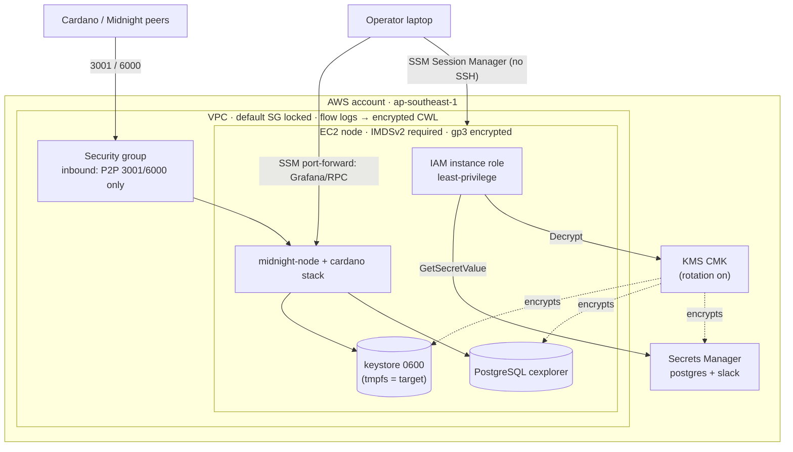

# SECURITY.md — Key Management

Key-management notes for an operator. A Midnight FNO holds four sensitive keys
(see `RUNBOOK.md` §3.2):

| Key | Scheme | Blast radius if compromised |
|---|---|---|
| **Aura** | sr25519 | Attacker can author blocks as you → equivocation, slashing/reputation |
| **Grandpa** | ed25519 | Attacker can cast finality votes as you → can contribute to finalizing a malicious fork |
| **Cross-Chain (beef)** | ecdsa | Attacker can act in Cardano↔Midnight bridging under your identity |
| **Node key** | ed25519 | Impersonation of your PeerID; lower severity but enables eclipse/routing games |

The Aura, Grandpa and Cross-Chain keys are the "hot" signing keys — they must be online
for the validator to function, which is precisely what makes their storage hard.

## Security architecture (this lab)

How secrets, encryption, identity, and access fit together in the Terraform-provisioned host.
Solid lines = runtime data flow; dashed = "encrypts". The `tmpfs` keystore is the target (see
§1); today the keystore is on-disk `0600`.

---

## 1. Key storage in a production cloud environment

**Recommended posture: generate and hold the master material in an HSM/KMS, run the node
against short-lived derived material or a tightly-scoped secrets manager, never persist
plaintext keys on the instance disk or in Git.**

Layered approach, strongest first:

### Option A — HSM / cloud HSM (highest assurance)
- **What:** FIPS 140-2/3 hardware (AWS CloudHSM, Azure Dedicated HSM, YubiHSM 2, Ledger).
  Private key is generated inside the device and is **non-exportable**; signing happens in
  the device.
- **Pros:** key material never exists in host memory as plaintext; strong tamper
  resistance; clean audit trail.
- **Cons / reality check:** Substrate/Midnight expects keys in a local **keystore** and
  signs in-process — there is no first-class "sign via PKCS#11" path for Aura/Grandpa
  today. HSM fits the **Cross-Chain ecdsa** key (standard curve, remote-signing friendly)
  and offline **backup/root** material better than the hot session keys. Cost and
  operational complexity are high.

### Option B — Cloud KMS as a key-encryption-key (KEK) — pragmatic default
- **What:** Keep the session keys encrypted at rest (envelope encryption). The DEK that
  wraps the keystore lives in AWS KMS / Azure Key Vault / GCP KMS; the instance role can
  only **decrypt**, never export the KMS key. Decrypt into a `tmpfs` (RAM) keystore at
  service start.
- **Pros:** no plaintext key on persistent disk; rotation of the KEK is trivial;
  IAM-scoped, fully audited (CloudTrail); low cost.
- **Cons:** plaintext key still transits host memory while the node runs (unavoidable for
  in-process signing); depends on correct IAM boundaries.

### Option C — Secrets manager (HashiCorp Vault / AWS Secrets Manager / Azure Key Vault)
- **What:** Store the `secretPhrase`/keystore blobs in the manager; inject at runtime via
  **systemd `LoadCredential=`** or Vault Agent into `tmpfs`. Vault adds dynamic secrets,
  leasing, and fine-grained policy.
- **Pros:** central rotation, versioning, access policy, audit; integrates with the FNO
  Docs' own recommendation.
- **Cons:** the manager becomes a high-value target — must itself be hardened (auto-unseal
  via KMS, short TTLs, MFA on human access).

### Baseline controls regardless of option
- `chmod 600` on every key file; keystore dir `700`; dedicated non-login `midnight` user.
- Keystore on **`tmpfs`** so plaintext keys are never written to persistent/backed-up disk
  or snapshots. Note that a snapshot of an EBS/Lightsail volume containing a plaintext
  keystore leaks the keys, so exclude them.
- Secrets **never** in Git, env files committed to VCS, container images, or logs.
  `.gitignore` in this repo blocks the key JSON files, `.env`, `.pgpass`, `secret_ed25519`
  and `*_ed25519`, `privatekey`/`publickey`, `wg0.conf`, and the Slack webhook.
- Offline, encrypted backup of the generative material (`aura.json` etc.) in a separate
  trust domain (e.g. hardware-encrypted, air-gapped) — kept **only** for disaster recovery.
- Least-privilege IAM: the node's instance role can *decrypt one specific* KMS key and
  read *one* secret path; nothing else.

**My default recommendation:** Option B (KMS envelope + `tmpfs` keystore) for the hot
Aura/Grandpa keys, Option A (HSM) for the Cross-Chain ecdsa key and for the cold backup
of all key material. This gives non-negotiable "no plaintext at rest / in snapshots"
while staying operationally realistic for a Substrate node that signs in-process.

---

## 2. Key rotation with minimal disruption

Rotation strategy differs by key because they are anchored differently:

**Session keys (Aura + Grandpa) — rotate WITHOUT downtime using the session mechanism.**
Substrate/Midnight's session model (the same **n+2 epoch** cadence used for onboarding) is
designed for hitless key changes:

1. Generate new Aura/Grandpa keys and insert them into the running node's keystore
   (`author_rotateKeys` / `key insert`). The node now holds both old and new.
2. Register the new public keys (set-keys) with the Foundation / partner-chain registration.
3. The new keys take effect at **epoch n+2**; the old keys keep signing until then — no gap
   in block production or finality.
4. After n+2 is confirmed and you see the node signing with the new keys, retire and
   securely destroy the old material.

**Cross-Chain (ecdsa) key — requires re-registration.**
Because it is bound to the Cardano-side registration/bridging identity, rotating it means
submitting an updated `partner-chains-public-keys.json` and waiting for the Foundation to
authorise it (again subject to n+2). Overlap the old and new during the transition so
bridging is never left without a valid key.

**Node key (PeerID) — lowest disruption but changes identity.**
Rotating regenerates the PeerID; update any boot-node/peer allow-lists and telemetry that
reference it. Do it during a maintenance window; expect a brief peer re-discovery.

**Risks & mitigations**
| Risk | Mitigation |
|---|---|
| Gap in block production / missed finality during cutover | Use the n+2 overlap window; never remove old keys before new are active |
| Equivocation (two nodes signing with the same key) | Single active signer at a time; if using standby, ensure only one holds active session keys |
| New keys not authorised in time → dropped from validator set | Register new public keys **≥2 epochs before** retiring old; verify whitelist status first |
| Old key material lingering after rotation | Cryptographically wipe from keystore, backups, and any KMS/secret versions; confirm deletion |
| Rotation itself leaking keys | Perform generation on the node/HSM, transmit only public keys, log the event to the audit trail |

**Cadence:** scheduled rotation (e.g. quarterly) for hygiene, plus immediate emergency
rotation on any suspected exposure (§3).

---

## 3. Incident response — suspected signing-key exposure

An operator reports their signing key may be exposed. **First three actions:**

1. **Contain — take the compromised signer offline immediately.**
   Stop the validator (`systemctl stop midnight-node`) or isolate the host so the key can
   no longer sign. A key that cannot sign cannot be abused for equivocation/malicious
   finality. This is first because the ongoing risk (double-signing → slashing, forged
   finality votes) outweighs the short availability loss of one node.

2. **Notify + revoke/rotate — engage the Foundation and start emergency key rotation.**
   Alert the Midnight Foundation and security on-call so the exposed public key can be
   de-authorised / removed from the validator set, and begin generating replacement keys
   (§2) on clean, trusted hardware. Coordination matters because the network — not just the
   operator — must stop trusting the key.

3. **Investigate & preserve evidence — scope the breach.**
   Snapshot host memory/disk and pull logs (auth, systemd/journal, KMS/Vault access,
   CloudTrail) **before** rebuilding, to determine how/when the key leaked, whether other
   keys or hosts are affected, and the exposure window. Findings drive whether this was a
   one-key incident or a host/credential compromise requiring wider rotation.

**Why this order:** contain (stop the bleeding) → notify/revoke (remove network trust so
the key is worthless to the attacker) → investigate (prevent recurrence). Rebuild the host
from a known-good image and restore only *public* registration data; treat every secret
that lived on the compromised host as burned and rotate it.

---

## 4. Additional operational best practices

Practices that harden the four practices above, roughly in priority order for a validator:

- **Prevent equivocation (the validator-specific failure).** Only one process may hold the
  *active* session keys at any time. A standby/HA node must not carry live Aura/Grandpa keys;
  if it did and both signed, the node self-slashes/loses reputation. Enforce single-active-signer
  operationally (and, longer term, with a remote signer that has anti-double-sign guards).
- **Generate and back up cold material offline.** Create the recovery copy of key material on
  an air-gapped machine; store it encrypted, split with **M-of-N (Shamir) sharing** across
  separate custodians/locations so no single person or safe can reconstruct it. Never store
  the only copy on the node.
- **Least privilege + separation of duties + MFA.** The node's cloud role may only *decrypt*
  one specific KMS key / read one secret path — nothing else. Human access to the secrets
  store requires MFA and ideally two-person approval for key operations; keep a break-glass
  path that is itself audited.
- **Audit everything and alert on anomalies.** Enable Vault audit devices / CloudTrail /
  KMS access logs for every key access, ship them off-host (tamper-evident), and alert on
  unexpected `Decrypt`/`sign` calls or access from new principals or IPs.
- **Verify the binary before it touches keys (supply chain).** A key is only as safe as the
  process holding it. Check the `midnight-node` release checksum/signature before running it,
  pin the version, and run the node as a non-login user with a read-only root filesystem.
- **Isolate the signer on the network.** Bind RPC to `localhost` (do not expose `9933`
  publicly), allow only the P2P port inbound, and keep the node in a private subnet reachable
  via bastion/VPN for admin.
- **Test recovery, don't assume it.** Periodically rehearse restoring from the encrypted
  backup and rotating keys, so the runbook works under pressure. Exclude any volume/snapshot
  that ever held a plaintext keystore from routine backups (see the `tmpfs` note in §1).

---

## 5. What's actually implemented in this lab (`terraform/`)

The design above is the target; within the scope and resources of this lab, the following are
wired up in Terraform today:

- **Secrets in AWS Secrets Manager, not on disk or in code.** The Postgres password is
  generated by Terraform (`random_password`) and stored in Secrets Manager; the optional Slack
  webhook too. The instance reads them at boot via `fetch-node-secrets.sh` and writes `.pgpass`
  `0600`. Nothing secret is typed, committed, or emitted as a Terraform output.
- **KMS CMK (rotation enabled)** with an explicit key policy encrypts the secrets, the **EBS
  root volume**, and the **VPC flow-log group** at rest.
- **Least-privilege IAM instance role**: `secretsmanager:GetSecretValue` on only the two
  secret ARNs, `kms:Decrypt` on only that key, plus SSM core — nothing else.
- **No SSH by default**: admin access is **SSM Session Manager**; port 22 is closed unless
  explicitly enabled with a restricted CIDR.
- **Minimal network exposure**: the security group opens only P2P (3001/6000); RPC (9933),
  Prometheus (9615) and Grafana (3000) are never public and are reached via SSM port-forwarding.
  The VPC's **default security group is locked** (deny all).
- **IMDSv2 required** (`http_tokens = required`, hop limit 1) to blunt SSRF credential theft.
- **Network audit trail**: **VPC flow logs** to an encrypted CloudWatch log group.
- **Slack webhook**: single source of truth in Secrets Manager, materialised to a `0600` file
  for Alertmanager / the health checker (see `monitoring/README.md` — never in git or config).
- **Supply chain**: `scripts/setup_node.sh` and the runbook verify SHA-256 checksums for the
  cardano-node and midnight-node downloads before use (cardano-db-sync ships no upstream
  checksum — noted as a known gap). CI runs **gitleaks** as the secret-scanning gate.

**Known lab-scope gaps** (would close for production, per §1–§4): Terraform state holds the
generated password in plaintext (use the encrypted S3 backend + restricted access; it is
git-ignored here); the validator session keys themselves are still generated on-box per the
runbook rather than in an HSM; and there is no HA/remote-signer yet.
