# Evidence — visual walkthrough

End-to-end pre-prod run on AWS (Singapore), 2026-07-13/14. Every screenshot is embedded below with
a one-line note on what it proves. Secrets are redacted in the images.

> **Read this first:** *Peer count = 1*, *Best block = 0*, and the health check reporting *DEGRADED*
> are the **expected** state for an unauthorised lab FNO, not faults — see
> [Expected observations](#expected-observations-honest-read) at the bottom.

**Jump to:** [1. Provision](#1-provision-terraform) · [2. Node onboarding](#2-node-onboarding--automation)
· [3. Sync & progression](#3-sync--block-progression) · [4. Monitoring & alerting](#4-monitoring--alerting)
· [5. Teardown](#5-teardown)

---

## 1. Provision (Terraform)

**`terraform apply` → 26 resources created** — VPC, EC2 `r6i.2xlarge`, KMS CMK, Secrets Manager, IAM,
security group, VPC flow logs. Secrets redacted.

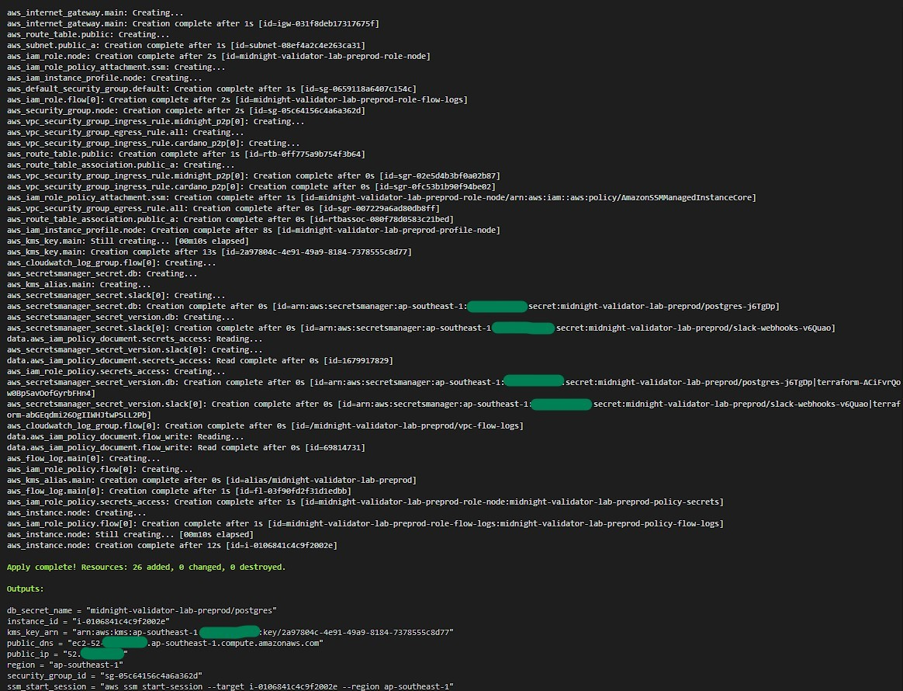

---

## 2. Node onboarding & automation

**`setup_node.sh` phase A** — prereqs, Postgres password pulled from Secrets Manager, Mithril
snapshot download.

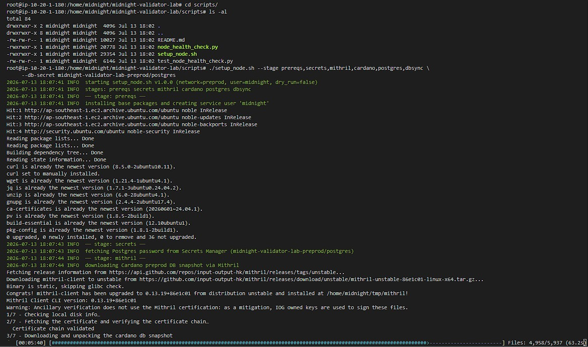

**cardano-db-sync installed + systemd service created.**

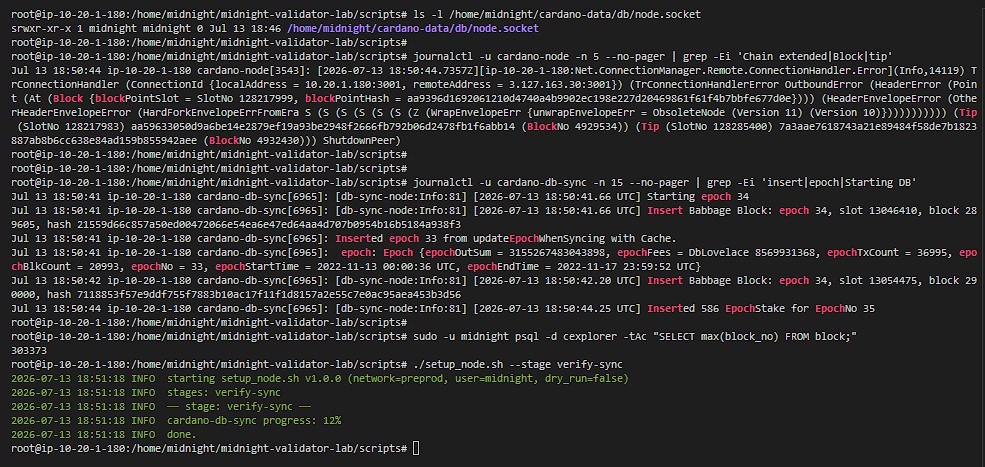

**Phase A (Cardano availability layer) complete.**

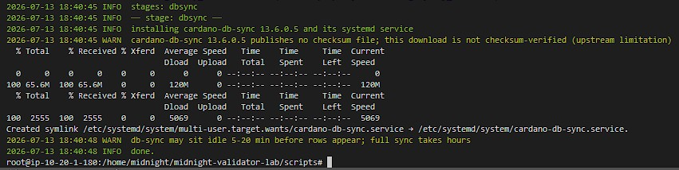

**db-sync importing Cardano blocks into `cexplorer`** — also captures the `ObsoleteNode` moment that
triggered the PV11 upgrade (see root README Troubleshooting #5).

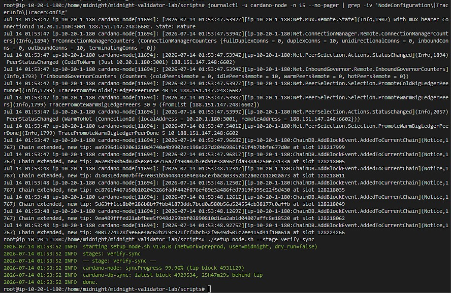

**`setup_node.sh` phase B** — midnight-node downloaded (checksum OK) + `res/` extracted.

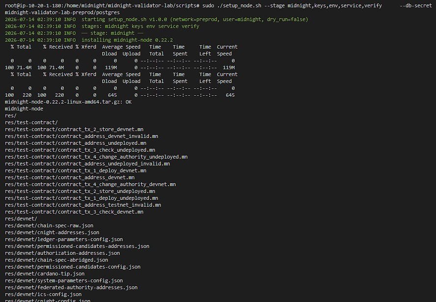

**Phase B continued** — session keys generated (node **PeerID** shown), `.env` written, validator
service installed, verify stage.

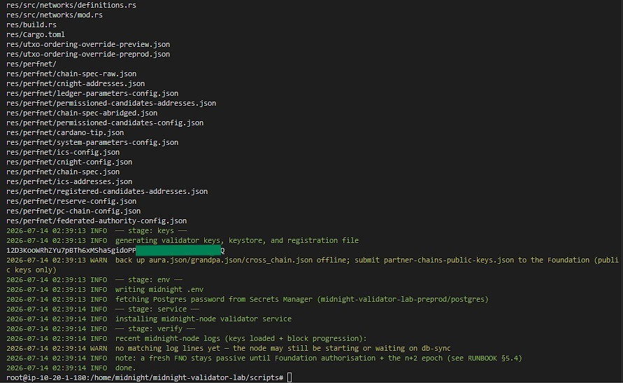

**Validator session keys + registration file** (`partner-chains-public-keys.json`). Mnemonics
redacted; this is a throwaway node that is not registered and is destroyed after the run.

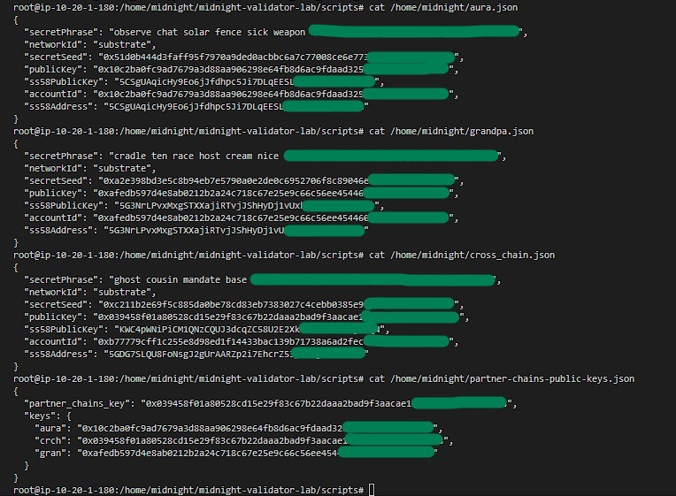

---

## 3. Sync & block progression

**Final capture** — the demonstrable height increase is on the **Cardano layer**:
`cexplorer.block_no` climbs **4933777 → 4933789**, `verify-sync` shows `syncProgress 100.00%`, the
keystore holds the session keys, and `system_health` / `system_peers` / the health checker are shown.

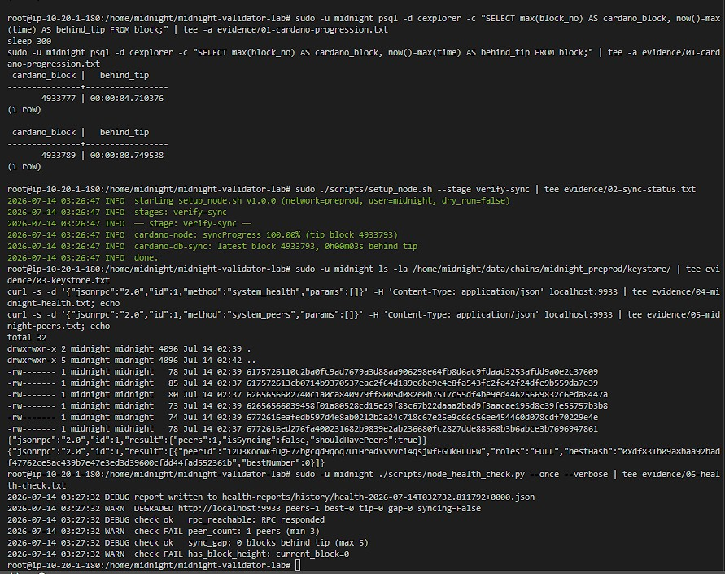

---

## 4. Monitoring & alerting

**Monitoring stack up** — prometheus / alertmanager / grafana / node-exporter all running.

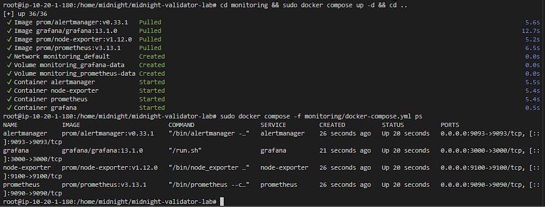

**SSM port-forward** — reaching a private port (Grafana 3000) with no public exposure.

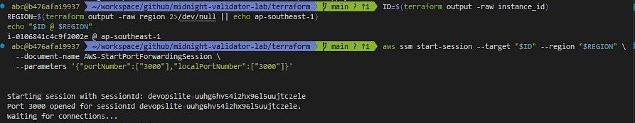

**Grafana dashboard** — best/finalized block, peer count, node-up, host CPU/mem/disk. (Best block 0
and peers 1 are the expected state — see the honest note below.)

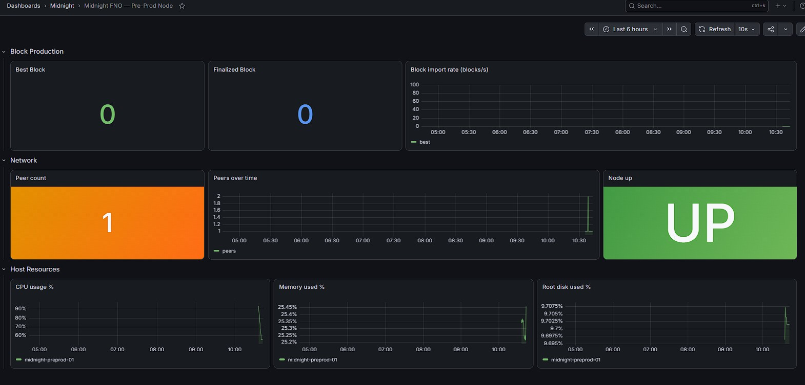

**Prometheus targets UP** — `midnight-node:9615`, `node-exporter:9100`, `prometheus`.

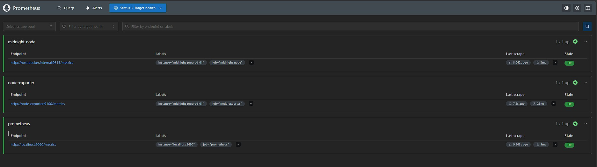

**Prometheus rules — 10 alert rules** across 3 groups (host-resources / midnight-core /
midnight-supporting); 3 firing given the genesis/low-peer state.

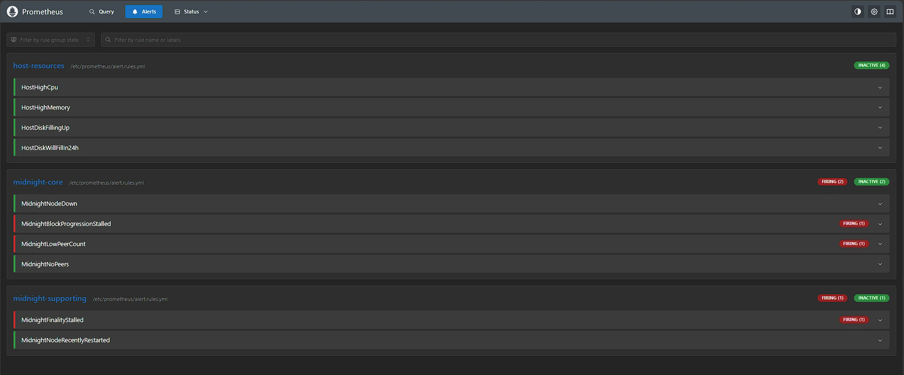

**Alertmanager routing** — `slack-critical` ← BlockProgressionStalled; `slack-warnings` ←
FinalityStalled + LowPeerCount.

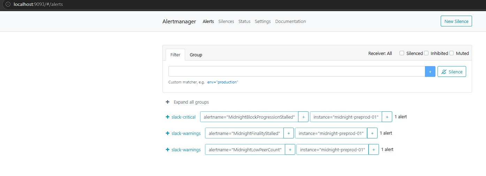

**`#midnight-critical`** received the `critical` alert (summary + detail + runbook link).

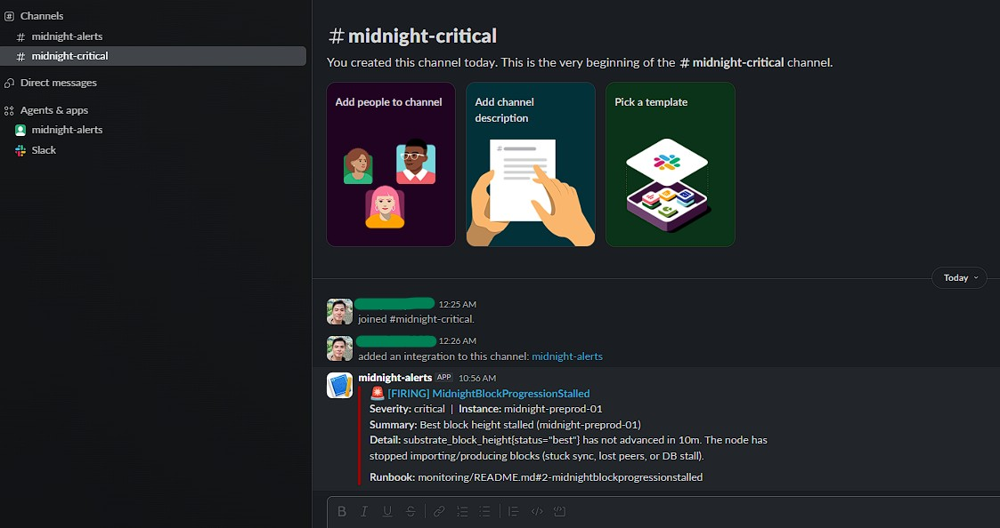

**`#midnight-alerts`** received the two `warning` alerts.

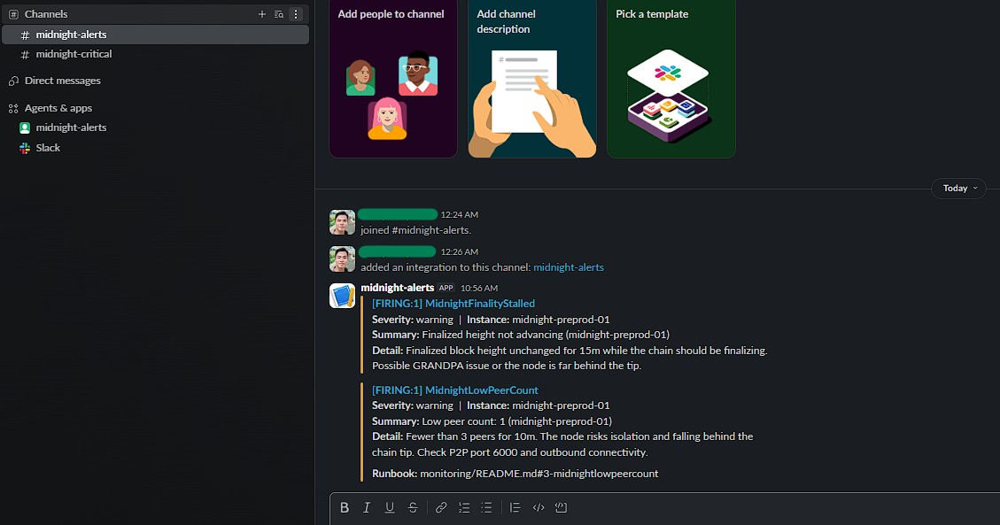

→ Together: the full pipeline **Prometheus → Alertmanager → Slack**, with **two channels routed by
severity**, working end to end.

---

## 5. Teardown

**`terraform destroy` → 26 resources destroyed** — clean teardown, no lingering paid resources.

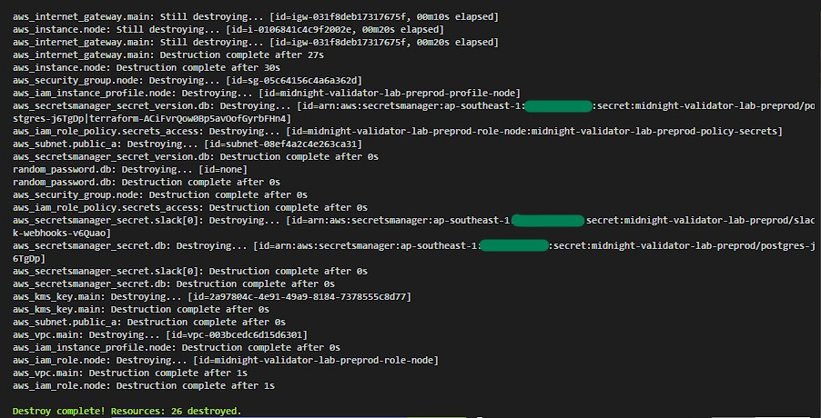

---

## Expected observations (honest read)

These are the **correct** state for an unauthorised lab FNO, not defects — full detective trail in the
root [`README.md`](../README.md) Troubleshooting #9:

- **Peer count = 1.** Of the two official pre-prod bootnodes, only `bootnode-2` was reachable on
  TCP/30333; `bootnode-1`'s endpoint was down from our side. The pre-prod P2P set is small.
- **Best block = 0.** The reachable bootnode itself reports `bestNumber: 0`, and our node's genesis
  hash matches it — so there is **no block above genesis to import**. The node is synced to what the
  network exposes, not stuck. A fresh FNO advancing its own Midnight height needs committee
  authorisation + the n+2 epoch (out of a lab window), and this node is deliberately **not**
  registered with the Foundation. The demonstrable block-height increase is therefore on the
  **Cardano** layer (§3 above).
- **Health checker = DEGRADED.** It fails `peer_count` (1 < 3) and `has_block_height` (0) while
  passing `rpc_reachable` and `sync_gap` — the tool correctly detects the conditions above rather
  than green-washing.

### Version note (evidence vs. repo pin)

The screenshots show **cardano-db-sync 13.6.0.5**, while the repo pins **13.7.2.1** — intentional, not
a mismatch. The PV11 blocker was *cardano-node*, so on the throwaway host only that was upgraded
(10.6.2 → 11.0.1); db-sync 13.6.0.5 kept importing across the fork (PV11 is intra-era Conway, so the
older db-sync still parses the blocks) and was left as-is. The repo pins **13.7.2.1** because it is the
officially matched pair for node 11.0.1 and the correct choice for a fresh install. `cardano-node` in
the final state is `11.0.1` (it had to be, to cross the fork and reach `syncProgress 100%`).
